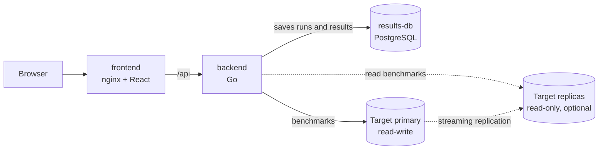

# PostgreSQL Benchmark

[](https://github.com/ISOGrid-by-SkyVault/postgres-benchmark/actions/workflows/ci.yml)

An [ISOGrid](https://isogrid.skyvault.pro) example: a Go application that benchmarks a PostgreSQL database, single-node or multi-node, and keeps the results in a small PostgreSQL database of its own.

Point it at a database, press **Start benchmark**, and it creates tables, loads data and measures one action at a time: bulk loads, inserts, lookups, joins across four tables, window functions, transactions and, on a cluster, replication lag. Run it against a single node and against a cluster, then compare the two runs side by side.

The repository has two applications:

- `backend/`: the Go API that runs the benchmarks.
- `frontend/`: the React UI, served by nginx in production.

## Architecture



| Service      | What it does                                             | Port | Image                             |
| ------------ | -------------------------------------------------------- | ---- | --------------------------------- |
| `frontend`   | UI, proxies `/api` to the backend                        | 8080 | `frontend/Dockerfile`             |
| `backend`    | Runs the benchmarks, stores and serves the results       | 8080 | `backend/Dockerfile`              |
| `results-db` | The mini database where runs and results are saved       | 5432 | `postgres:18-alpine`              |
| `target-db`  | A single-node PostgreSQL to benchmark out of the box     | 5432 | `postgres:18-alpine`              |

The database under test and the results database are separate on purpose: the benchmark never measures its own bookkeeping.

## What a run measures

Every action measures one thing. A run executes them in this order, each in a schema created for that run and dropped at the end.

| Action                             | Kind         | Runs on  | What it does                                                                 |
| ---------------------------------- | ------------ | -------- | ---------------------------------------------------------------------------- |
| Create schema                      | Schema       | primary  | Creates the schema and five tables linked by foreign keys                    |
| Bulk load (COPY)                   | Write        | primary  | Loads customers, products, orders and order items with `COPY`                |
| Build indexes                      | Schema       | primary  | Creates six secondary indexes, then runs `ANALYZE`                           |
| Replica catch-up *                 | Replication  | replica  | Time for every replica to replay the load and the index builds               |
| Point lookup                       | Read         | reader   | Fetches one customer by primary key                                          |
| Range scan                         | Read         | reader   | Reads up to 100 orders from a six-hour window through an index               |
| Two-table join                     | Join         | reader   | Joins orders to customers for one customer's latest orders                   |
| Four-table join with aggregation   | Join         | reader   | Revenue per product category for one country, across four tables             |
| CTE with window functions          | Join         | reader   | Ranks a country's customers by spend with `rank()` and a running share       |
| Anti-join (NOT EXISTS)             | Join         | reader   | Products of a category nobody ordered in the last week                       |
| Single-row insert                  | Write        | primary  | One order per statement                                                      |
| Batch insert (100 rows)            | Write        | primary  | 100 order items per statement                                                |
| Update by primary key              | Write        | primary  | Changes the status of one order                                              |
| Multi-statement transaction        | Transaction  | primary  | Locks a product, decrements stock, inserts an order and its item, commits    |
| Delete by primary key              | Write        | primary  | Deletes one order item                                                       |
| Replication lag *                  | Replication  | replica  | Commits a row on the primary and times how long until a replica can read it  |
| Drop schema                        | Schema       | primary  | Drops everything the run created                                             |

\* Only when read replicas are configured. "reader" means the replicas when there are any, the primary otherwise.

Timed actions run for a fixed duration from several concurrent workers. For each one the application records the number of operations, operations per second, errors, and the latency average, p50, p95, p99, minimum and maximum. One-shot actions record their duration.

A run takes three parameters:

| Parameter         | Default | Range            | Meaning                                              |
| ----------------- | ------- | ---------------- | ---------------------------------------------------- |
| `scale`           | 10,000  | 1,000 to 200,000 | Customers loaded. Orders are 5x that, order items 10x |
| `concurrency`     | 8       | 1 to 32          | Parallel workers of each timed action                |
| `durationSeconds` | 3       | 1 to 30          | How long each timed action runs                      |

## Single node and multi-node

The application detects the topology of its target when a run starts and saves it with the results.

- **Single node.** One endpoint, no standby. Every action runs on it.
- **Multi-node behind one address.** A managed, highly available cluster usually gives you a single address. Set only `TARGET_DATABASE_URL`. The application counts the standbys the primary reports in `pg_stat_replication` and labels the run multi-node. Reads and writes both go through that address, so the results show what replication costs on writes.
- **Multi-node with read endpoints.** If you also have read-only addresses, list them in `TARGET_REPLICA_URLS`. Read actions are then spread over the replicas, and two more actions measure replica catch-up and replication lag.

To compare, run the benchmark on each topology with the same parameters, open one run and choose the other under **Compare with**.

## Deploy on ISOGrid with a managed PostgreSQL

1. Create a managed PostgreSQL database on ISOGrid, single or highly available. See [Databases](https://docs.isogrid.skyvault.pro/guide/databases).
2. Connect this repository. ISOGrid reads `docker-compose.yml` and the two Dockerfiles. See [Git repositories](https://docs.isogrid.skyvault.pro/guide/git-repositories) and [Deploying an application](https://docs.isogrid.skyvault.pro/guide/deploying-an-application).
3. On the `backend` service, store the database address as a **secret** named `TARGET_DATABASE_URL`, and optionally set `TARGET_LABEL` to a name you will recognise in the results, such as `Managed PostgreSQL (HA)`.
4. Deploy and open the `frontend` service (port 8080).

The database user needs permission to create a schema in the target database. The application only touches schemas it creates, named `bench_<run id>`.

If the backend is not reachable as `backend` on the internal network, set `BACKEND_UPSTREAM` on the `frontend` service to its internal address.

## Run it locally

You need Docker with Compose.

```bash
git clone https://github.com/ISOGrid-by-SkyVault/postgres-benchmark.git
cd postgres-benchmark
docker compose up --build
```

Open http://localhost:3000. If the port is taken: `FRONTEND_HOST_PORT=3900 docker compose up --build`.

### Try a local multi-node target

An extra compose file adds a streaming replica to the bundled target database:

```bash
docker compose -f docker-compose.yml -f deploy/multi-node/docker-compose.yml up --build
```

The UI now shows "Multi-node, 2 nodes", reads go to the replica and the two replication actions join the suite. This is a demo cluster with no failover.

To go back to a single node, stop the stack and start it again without the extra file.

### Development with hot reload

```bash
docker compose -f docker-compose.dev.yml up --build
```

Open http://localhost:5173.

- **Backend**: [air](https://github.com/air-verse/air) rebuilds and restarts the Go server when a `.go` file changes.
- **Frontend**: the Vite dev server updates the page when a source file changes.

The API is also published on http://localhost:8080 and the two databases on ports 5433 (results) and 5434 (target).

## Production behaviour: fail loudly

`docker-compose.yml` is the production file. Its rule is that a broken application must look broken to Docker, and so to the platform running it.

- The backend is a single static binary running as PID 1 in a distroless image. There is no supervisor and no shell between Docker and the process: when the process exits, the container exits with its status.
- The backend exits with status 1 when:
  - a required variable is missing or invalid,
  - the results database or the target database cannot be reached at startup,
  - the HTTP port cannot be opened,
  - the results database stops answering for 6 consecutive checks (about one minute). `/healthz` returns 503 from the first failed check, so the container is reported `unhealthy` before it exits.
- `restart: on-failure:5` lets Docker retry a few times, then leaves the container stopped with its failing exit status instead of restarting it forever.
- Every service has a healthcheck. The backend image contains no curl, so the binary probes itself: `/server healthcheck`.
- On `SIGTERM` the backend stops accepting requests, cancels the run in progress, records it as failed, drops its schema and exits with status 0.

A target database that goes away while the application is running is not fatal. The run in progress fails with the error, and the UI shows the target as unreachable. That keeps the application usable for testing a failover.

The development file is the opposite: air keeps the container alive across crashes and build errors so you can fix the code and carry on.

## Configuration

| Variable                   | Default                      | Service  | Description                                                        |
| -------------------------- | ---------------------------- | -------- | ------------------------------------------------------------------ |
| `TARGET_DATABASE_URL`      | the bundled `target-db`      | backend  | Read-write address of the database to benchmark. Secret.           |
| `TARGET_REPLICA_URLS`      | empty                        | backend  | Comma-separated read-only addresses. Secret.                       |
| `TARGET_LABEL`             | `Bundled PostgreSQL`         | backend  | Name of the target shown in the UI and saved with each run         |
| `TARGET_MAX_CONNECTIONS`   | `32`                         | backend  | Connections per target endpoint, and the highest concurrency       |
| `RESULTS_DATABASE_URL`     | the bundled `results-db`     | backend  | Address of the results database. Secret.                           |
| `RESULTS_DB_PASSWORD`      | `benchmark`                  | compose  | Password of the bundled results database. Secret.                  |
| `TARGET_DB_PASSWORD`       | `benchmark`                  | compose  | Password of the bundled target database. Secret.                   |
| `HEALTH_INTERVAL_SECONDS`  | `10`                         | backend  | How often the results database is checked                          |
| `HEALTH_FAILURE_THRESHOLD` | `6`                          | backend  | Failed checks in a row before the process exits                    |
| `PORT`                     | `8080`                       | backend  | HTTP port of the API                                               |
| `BACKEND_UPSTREAM`         | `http://backend:8080`        | frontend | Address nginx proxies `/api` to                                    |
| `FRONTEND_HOST_PORT`       | `3000`                       | compose  | Host port of the UI                                                |

The two bundled databases are only reachable on the internal network and use a default password so the example starts with no setup. Change `RESULTS_DB_PASSWORD` and `TARGET_DB_PASSWORD` for anything long-lived. If you change `TARGET_DB_PASSWORD`, set `TARGET_DATABASE_URL` to match.

Addresses are URLs, so special characters in a password must be percent-encoded. Each address can also be given as a file path in `TARGET_DATABASE_URL_FILE`, `TARGET_REPLICA_URLS_FILE` or `RESULTS_DATABASE_URL_FILE`, which is how Docker Swarm and Kubernetes mount secrets. The application never logs a password.

## API

| Method | Path             | Description                                                |
| ------ | ---------------- | ---------------------------------------------------------- |
| GET    | `/healthz`       | 200 when the results database answers, 503 otherwise       |
| GET    | `/api/info`      | Target topology, limits and the list of actions            |
| POST   | `/api/runs`      | Start a run. 409 if one is already in progress             |
| GET    | `/api/runs`      | The 50 most recent runs                                    |
| GET    | `/api/runs/{id}` | One run with the results recorded so far                   |
| DELETE | `/api/runs/{id}` | Delete a finished run                                      |

```bash
# through the frontend proxy
curl -X POST http://localhost:3000/api/runs \
  -H "Content-Type: application/json" \
  -d '{"scale": 10000, "concurrency": 8, "durationSeconds": 3}'

curl http://localhost:3000/api/runs/<id>
```

A link such as `http://localhost:3000/?run=<id>&compare=<other id>` opens the UI on a comparison.

## Project structure

```
.
├── backend/
│   ├── cmd/server/           Entry point, shutdown, health watchdog
│   ├── internal/config/      Environment variables
│   ├── internal/api/         HTTP handlers
│   ├── internal/bench/       The runner, the actions and the statistics
│   ├── internal/target/      Connections to the database under test, topology detection
│   ├── internal/store/       Results database: schema and queries
│   ├── Dockerfile            Production image
│   └── Dockerfile.dev        Hot-reload image (air)
├── frontend/
│   ├── src/                  React application
│   ├── nginx.conf.template   Production web server and /api proxy
│   ├── Dockerfile            Production image
│   └── Dockerfile.dev        Hot-reload image (Vite)
├── deploy/multi-node/        Compose overlay adding a streaming replica
├── scripts/smoke-test.sh     Starts a run and checks it completes
├── docker-compose.yml        Production
└── docker-compose.dev.yml    Development with hot reload
```

## Tests

```bash
cd backend && go test ./...            # unit tests
cd frontend && npm ci && npm run build # type check and build

# end to end, against a running stack
docker compose up --build -d --wait
./scripts/smoke-test.sh http://localhost:3000
```

GitHub Actions runs all of these on every push and pull request, including the end-to-end test on both the single-node and the multi-node stack.

## Reading the numbers

This is a demonstration workload, not TPC. Use it to compare two setups under the same parameters, not to quote absolute figures.

- The backend and the database share a network path. Latency includes it.
- With the bundled databases everything runs on one machine and competes for the same CPU and disk.
- Short durations are noisy. Use 5 seconds or more per action when the comparison matters.
- There is no authentication. Anyone who can reach the UI can start a run, which loads the target database. Do not expose it publicly next to a database that matters.

## License

[MIT](LICENSE)

## Learn more

- [ISOGrid documentation](https://docs.isogrid.skyvault.pro/)
- [ISOGrid](https://isogrid.skyvault.pro)
